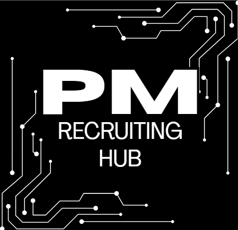

  

---

## 📖 About

**PM Recruiting Hub** is an open-source, community-maintained directory of Product Management recruiting opportunities for students and early-career professionals. It covers Product Management internships, Associate Product Manager (APM) programs, Technical Program Management (TPM) roles, Product Ops, and everything in between.

**Supported recruiting cycles:** Fall 2026 • Spring 2027 • Summer 2027 • *(future cycles added as they open)*

## 🔥 Recently Added Opportunities

<!-- RECENT_OPPORTUNITIES_START -->

| Company | Role | Location | Start Term | Application Status | Link |
|---|---|---|---|---|---|
| Apple | Engineering Program Management Undergrad Internships | Varies | Fall 2026,Spring 2027,Summer 2027 | 🟢 Open | https://jobs.apple.com/en-us/details/200664330-3810/engineering-program-management-undergrad-internships |
| AppleEFEWFSF | Engineering Program Management Masters Internships | Varies | Fall 2026,Spring 2027,Summer 2027 | 🟢 Open | https://jobs.apple.com/en-us/details/200664336-3810/engineering-program-management-masters-internships |
| salesforce | Summer 2027 Intern - Associate Product Manager (APM) | San Francisco, California | Summer 2027 | 🟢 Open | https://www.salesforce.com/company/careers/jobs/JR348039/summer-2027-intern-associate-product-manager-apm/ |
| Snowflake | AI-Powered BI Intern: Fall 2026 | Location Menlo Park, California, United States | Fall 2026 | 🟢 Open | https://careers.snowflake.com/us/en/job/SNCOUS37E886ABE05B4F2A9A4161BFD89E660FEXTERNALENUS634E9517583C446C9A13C0C5FE5960BB/AI-Powered-BI-Intern-Fall-2026?utm_source=Q2P9NP2NNP&utm_medium=phenom-feeds&gh_src=ed5543a62 |
| databricks | Product Management Intern | Bellevue, WA; Mountain View, CA; San Francisco, CA | Summer 2027 | 🟢 Open | https://www.databricks.com/company/careers/product/product-management-intern-summer-2027-6883068002 |

<!-- RECENT_OPPORTUNITIES_END -->

---

## ⏰ Closing Soon

<!-- CLOSING_SOON_START -->

| Company | Role | Location | Start Term | Deadline | Application Status | Link |
|---|---|---|---|---|---|---|
| salesforce | Summer 2027 Intern - Associate Product Manager (APM) | San Francisco, California | Summer 2027 | Jul 24, 2026 | 🟢 Open | https://www.salesforce.com/company/careers/jobs/JR348039/summer-2027-intern-associate-product-manager-apm/ |

<!-- CLOSING_SOON_END -->

---

## 📅 Recruiting Timeline *Coming Soon - switching to Notion Page later*

A high-level view of the PM recruiting calendar. Full breakdown in [resources/recruiting-timeline.md](resources/recruiting-timeline.md).

| Phase | Typical Window | Focus |
|---|---|---|

---

## 📱 Product Management

Full list: [opportunities/product-management.md](opportunities/product-management.md)

<!-- PRODUCT_MANAGEMENT_START -->

| Company | Role | Location | Start Term | Application Status | Link |
|---|---|---|---|---|---|
| salesforce | Summer 2027 Intern - Associate Product Manager (APM) | San Francisco, California | Summer 2027 | 🟢 Open | https://www.salesforce.com/company/careers/jobs/JR348039/summer-2027-intern-associate-product-manager-apm/ |
| databricks | Product Management Intern | Bellevue, WA; Mountain View, CA; San Francisco, CA | Summer 2027 | 🟢 Open | https://www.databricks.com/company/careers/product/product-management-intern-summer-2027-6883068002 |

<!-- PRODUCT_MANAGEMENT_END -->

---

## 🚀 Associate Product Manager Programs

Full list: [opportunities/apm-programs.md](opportunities/apm-programs.md)

<!-- APM_PROGRAMS_START -->

<!-- APM_PROGRAMS_END -->

---

## ⚙️ Program Management

Full list: [opportunities/program-management.md](opportunities/program-management.md)

<!-- PROGRAM_MANAGEMENT_START -->

| Company | Role | Location | Start Term | Application Status | Link |
|---|---|---|---|---|---|
| Apple | Engineering Program Management Undergrad Internships | Varies | Fall 2026,Spring 2027,Summer 2027 | 🟢 Open | https://jobs.apple.com/en-us/details/200664330-3810/engineering-program-management-undergrad-internships |
| AppleEFEWFSF | Engineering Program Management Masters Internships | Varies | Fall 2026,Spring 2027,Summer 2027 | 🟢 Open | https://jobs.apple.com/en-us/details/200664336-3810/engineering-program-management-masters-internships |

<!-- PROGRAM_MANAGEMENT_END -->

---

## 📊 Product Operations

Full list: [opportunities/product-operations.md](opportunities/product-operations.md)

<!-- PRODUCT_OPERATIONS_START -->

<!-- PRODUCT_OPERATIONS_END -->

---

## Product-Adjacent/Other

Full list: [opportunities/product-adjacent/other.md](opportunities/product-adjacent/other.md)

<!-- PRODUCT_ADJACENT_START -->
_No opportunities currently listed._
<!-- PRODUCT_ADJACENT_END -->

---

## 🎓 New Grad Opportunities

Full list: [opportunities/new-grad.md](opportunities/new-grad.md)

<!-- NEW_GRAD_START -->

| Company | Role | Location | Start Term | Application Status | Link |
|---|---|---|---|---|---|
| databricks | Associate Product Manager, New Grad | Bellevue, WA; Mountain View, CA; San Francisco, CA | 2027 Start | 🟢 Open | https://www.databricks.com/company/careers/university-recruiting/associate-product-manager-new-grad-2027-start-7586263002 |

<!-- NEW_GRAD_END -->

---

## 🗂️ Browse by Recruiting Cycle

| Cycle | Link |
|---|---|
| Fall 2026 | [opportunities/fall-2026.md](opportunities/fall-2026.md) |
| Spring 2027 | [opportunities/spring-2027.md](opportunities/spring-2027.md) |
| Summer 2027 | [opportunities/summer-2027.md](opportunities/summer-2027.md) |

---

## 📚 Career Resources *Coming Soon - switching to Notion Page later*

| Resource | Description |
|---|---|
| [Recruiting Timeline](resources/recruiting-timeline.md) | When to prepare, apply, and interview |
| [Resume Resources](resources/resume-resources.md) | PM resume guidelines and bullet-writing frameworks |
| [Interview Resources](resources/interview-resources.md) | Product sense, execution, behavioral, and metrics prep |
| [Networking Resources](resources/networking-resources.md) | Cold outreach templates and coffee chat tips |
| [FAQ](resources/faq.md) | Common questions from students entering PM recruiting |

---

## 🏷️ Status Legend

| Symbol | Meaning |
|---|---|
| 🟢 Open | Application is currently open |
| 🟡 Opening Soon | Posting confirmed or expected soon |
| ⚪ Not Yet Open | Historically recruits this cycle, not yet posted |
| 🔴 Closed | Application window has closed |

---

## 🤝 How to Contribute *UNAVAILABLE AT THE MOMENT*

This repository is built **by** the PM recruiting community **for** the PM recruiting community. Anyone can contribute:

- ➕ [Add a new opportunity](.github/ISSUE_TEMPLATE/add-opportunity.md)
- 🚫 [Report an expired listing](.github/ISSUE_TEMPLATE/report-expired.md)
- 🏢 [Request a company be tracked](.github/ISSUE_TEMPLATE/request-company.md)
- 🐛 [Report a bug](.github/ISSUE_TEMPLATE/bug-report.md)

Read the full [CONTRIBUTING.md](CONTRIBUTING.md) for formatting rules and pull request guidelines.

---

## 📜 Code of Conduct

This project follows a [Code of Conduct](CODE_OF_CONDUCT.md). By participating, you agree to uphold a welcoming and respectful environment for everyone.

---

## ⚖️ License

This project is licensed under the [MIT License](LICENSE). Opportunity data is community-sourced and provided as-is; always verify details on the official company careers page before applying.

---

  
   
  Built by Abigail Bravo, for aspiring PMs ⭐ Star this repo to support PM Recruiting Hub!

