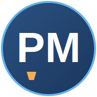

  

---

## 📖 About

**PM Recruiting Hub** is an open-source, community-maintained directory of Product Management recruiting opportunities for students and early-career professionals. It covers Product Management internships, Associate Product Manager (APM) programs, Technical Program Management (TPM) roles, Product Operations positions, and new grad PM roles — all in one place, kept fresh by contributors like you.

This project is inspired by the "awesome list" and internship-tracker traditions of the open-source community, purpose-built for the PM career path.

**Supported recruiting cycles:** Fall 2026 • Spring 2027 • Summer 2027 • *(future cycles added as they open)*

> 💡 **New here?** Start with the [Recruiting Timeline](resources/recruiting-timeline.md) to understand when to apply, then browse the tables below.

---

## 🔥 Recently Added Opportunities

*Updated as new listings are merged. Add your find via a pull request — see [Contributing](#-how-to-contribute).*

| Company | Role | Location | Recruiting Season | Application Status | Link |
|---|---|---|---|---|---|
| Stripe | Product Manager Intern | Remote (US) | Summer 2027 | 🟢 Open | _add link_ |
| Figma | APM Program | San Francisco, CA | Summer 2027 | 🟡 Opening Soon | _add link_ |
| NVIDIA | Technical Program Manager Intern | Santa Clara, CA | Summer 2027 | 🟢 Open | _add link_ |

---

## ⏰ Closing Soon

*Listings with known upcoming deadlines. Contributors: please update or remove once a deadline passes — see [Reporting Expired Listings](CONTRIBUTING.md#reporting-expired-listings).*

| Company | Role | Deadline | Link |
|---|---|---|---|
| _Add a closing-soon listing via PR_ | | | |

---

## 📅 Recruiting Timeline

A high-level view of the PM recruiting calendar. Full breakdown in [resources/recruiting-timeline.md](resources/recruiting-timeline.md).

| Phase | Typical Window | Focus |
|---|---|---|
| Early Preparation | Freshman / Sophomore year | Build foundations, join clubs, start projects |
| Summer Prep | May – July | Resume polish, networking, mock interviews |
| Fall Recruiting | August – November | Bulk of internship & new grad applications open |
| Interview Season | September – January | Product sense, execution, behavioral rounds |
| Spring Recruiting | January – April | Remaining internship & off-cycle roles |

---

## 📱 Product Management Internships

Full list: [opportunities/product-management.md](opportunities/product-management.md)

| Company | Role | Location | Recruiting Season | Application Status | Link |
|---|---|---|---|---|---|
| Apple | Product Manager Intern | Cupertino, CA | Summer 2027 | 🟢 Open | _add link_ |
| Microsoft | Product Manager Intern | Redmond, WA | Summer 2027 | 🟢 Open | _add link_ |
| Google | APM Intern (STEP/Related) | Mountain View, CA | Summer 2027 | 🟡 Opening Soon | _add link_ |
| Amazon | Product Manager Intern | Seattle, WA | Summer 2027 | 🟢 Open | _add link_ |
| Adobe | Product Manager Intern | San Jose, CA | Summer 2027 | 🟢 Open | _add link_ |
| Meta | Product Manager Intern | Menlo Park, CA | Summer 2027 | 🟡 Opening Soon | _add link_ |
| Visa | Product Manager Intern | Foster City, CA | Summer 2027 | ⚪ Not Yet Open | _add link_ |
| Capital One | Technology Product Manager Intern | McLean, VA | Summer 2027 | 🟢 Open | _add link_ |
| LinkedIn | Product Manager Intern | Sunnyvale, CA | Summer 2027 | ⚪ Not Yet Open | _add link_ |

---

## 🚀 Associate Product Manager Programs

Full list: [opportunities/apm-programs.md](opportunities/apm-programs.md)

| Company | Program Name | Location | Recruiting Season | Application Status | Link |
|---|---|---|---|---|---|
| Google | APM Program | Mountain View, CA | Fall 2026 | 🟢 Open | _add link_ |
| Meta | RPM (Rotational PM) Program | Menlo Park, CA | Fall 2026 | 🟢 Open | _add link_ |
| Uber | APM Program | San Francisco, CA | Fall 2026 | 🟡 Opening Soon | _add link_ |
| Airbnb | APM Program | San Francisco, CA | Fall 2026 | ⚪ Not Yet Open | _add link_ |
| Figma | APM Program | San Francisco, CA | Summer 2027 | 🟡 Opening Soon | _add link_ |
| Notion | APM Program | San Francisco, CA | Summer 2027 | ⚪ Not Yet Open | _add link_ |

---

## ⚙️ Technical Program Management

Full list: [opportunities/technical-program-management.md](opportunities/technical-program-management.md)

| Company | Role | Location | Recruiting Season | Application Status | Link |
|---|---|---|---|---|---|
| NVIDIA | TPM Intern | Santa Clara, CA | Summer 2027 | 🟢 Open | _add link_ |
| Amazon | TPM Intern | Seattle, WA | Summer 2027 | 🟢 Open | _add link_ |
| Microsoft | TPM Intern | Redmond, WA | Summer 2027 | 🟡 Opening Soon | _add link_ |
| Google | TPM Intern | Mountain View, CA | Summer 2027 | ⚪ Not Yet Open | _add link_ |

---

## 📊 Product Operations

Full list: [opportunities/product-operations.md](opportunities/product-operations.md)

| Company | Role | Location | Recruiting Season | Application Status | Link |
|---|---|---|---|---|---|
| Apple | Product Operations Intern | Cupertino, CA | Summer 2027 | 🟢 Open | _add link_ |
| Stripe | Product Operations Intern | Remote (US) | Summer 2027 | 🟢 Open | _add link_ |
| Capital One | Product Operations Analyst Intern | Richmond, VA | Summer 2027 | 🟡 Opening Soon | _add link_ |

---

## 🎓 New Grad Opportunities

Full list: [opportunities/new-grad.md](opportunities/new-grad.md)

| Company | Role | Location | Recruiting Season | Application Status | Link |
|---|---|---|---|---|---|
| Amazon | New Grad Product Manager | Seattle, WA | Fall 2026 | 🟢 Open | _add link_ |
| Adobe | New Grad Product Manager | San Jose, CA | Fall 2026 | 🟡 Opening Soon | _add link_ |
| Visa | New Grad Product Manager | Austin, TX | Fall 2026 | ⚪ Not Yet Open | _add link_ |
| LinkedIn | New Grad Product Manager | Sunnyvale, CA | Fall 2026 | ⚪ Not Yet Open | _add link_ |

---

## 🗂️ Browse by Recruiting Cycle

| Cycle | Link |
|---|---|
| Fall 2026 | [opportunities/fall-2026.md](opportunities/fall-2026.md) |
| Spring 2027 | [opportunities/spring-2027.md](opportunities/spring-2027.md) |
| Summer 2027 | [opportunities/summer-2027.md](opportunities/summer-2027.md) |

---

## 📚 Career Resources

| Resource | Description |
|---|---|
| [Recruiting Timeline](resources/recruiting-timeline.md) | When to prepare, apply, and interview |
| [Resume Resources](resources/resume-resources.md) | PM resume guidelines and bullet-writing frameworks |
| [Interview Resources](resources/interview-resources.md) | Product sense, execution, behavioral, and metrics prep |
| [Networking Resources](resources/networking-resources.md) | Cold outreach templates and coffee chat tips |
| [FAQ](resources/faq.md) | Common questions from students entering PM recruiting |

---

## 🏷️ Status Legend

| Symbol | Meaning |
|---|---|
| 🟢 Open | Application is currently open |
| 🟡 Opening Soon | Posting confirmed or expected soon |
| ⚪ Not Yet Open | Historically recruits this cycle, not yet posted |
| 🔴 Closed | Application window has closed |

---

## 🤝 How to Contribute

This repository is built **by** the PM recruiting community **for** the PM recruiting community. You don't need to be a maintainer to contribute — anyone can:

- ➕ [Add a new opportunity](.github/ISSUE_TEMPLATE/add-opportunity.md)
- 🚫 [Report an expired listing](.github/ISSUE_TEMPLATE/report-expired.md)
- 🏢 [Request a company be tracked](.github/ISSUE_TEMPLATE/request-company.md)
- 🐛 [Report a bug](.github/ISSUE_TEMPLATE/bug-report.md)

Read the full [CONTRIBUTING.md](CONTRIBUTING.md) for formatting rules and pull request guidelines.

---

## 📜 Code of Conduct

This project follows a [Code of Conduct](CODE_OF_CONDUCT.md). By participating, you agree to uphold a welcoming and respectful environment for everyone.

---

## ⚖️ License

This project is licensed under the [MIT License](LICENSE). Opportunity data is community-sourced and provided as-is; always verify details on the official company careers page before applying.

---

  
   
  Built by students, for students. ⭐ Star this repo to support the PM recruiting community.

