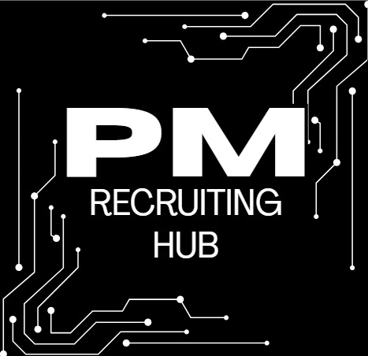

  

---

## 📖 About

**PM Recruiting Hub** is a maintained directory of Product Management recruiting opportunities for students and early-career professionals by Abigail Bravo. It covers Product Management internships, Associate Product Manager (APM) programs, Technical Program Management (TPM) roles, Product Ops, and everything in between. Wishing everybody luck this recruiting season, and hopefully I can help make it a bit easier!!

## Connect With Me! 🤝

  
  &nbsp;&nbsp;
  
  
  &nbsp;
  
  

**Supported recruiting cycles:** Fall 2026 • Spring 2027 • Summer 2027 • *(future cycles added as they open)*

## 🔥 Recently Added Opportunities

<!-- RECENT_OPPORTUNITIES_START -->

| Company | Role | Location | Start Term | Application Status | Link |
|---|---|---|---|---|---|
| Apple | Product Design Masters Engineering Internships | United States | Fall 2026,Spring 2027,Summer 2027 | 🟢 Open | https://jobs.apple.com/en-us/details/200663996-3810/product-design-masters-engineering-internships?team=STDNT |
| Apple | Product Design PhD Internships | United States | Fall 2026,Spring 2027,Summer 2027 | 🟢 Open | https://jobs.apple.com/en-us/details/200663969-3810/product-design-phd-internships?team=STDNT |
| Apple | Product Design Undergrad Internships | United States | Fall 2026,Spring 2027,Summer 2027 | 🟢 Open | https://jobs.apple.com/en-us/details/200664000-3810/product-design-undergrad-internships |
| Apple | Business, Marketing & Creative Masters Internships | United States | Fall 2026,Spring 2027,Summer 2027 | 🟢 Open | https://jobs.apple.com/en-us/details/200664247-3810/business-marketing-creative-masters-internships |
| appian | Product Manager (2027 Graduates) | McLean, Virginia | Summer 2027 | 🟢 Open | https://careers.appian.com/jobs/8069612-product-manager--2027-graduates- |

<!-- RECENT_OPPORTUNITIES_END -->

---

## ⏰ Closing Soon

<!-- CLOSING_SOON_START -->
_No opportunities currently closing soon._
<!-- CLOSING_SOON_END -->

---

## 📱 Product Management

See Full List HERE: [opportunities/product-management.md](opportunities/product-management.md)

<!-- PRODUCT_MANAGEMENT_START -->

| Company | Role | Location | Start Term | Application Status | Link |
|---|---|---|---|---|---|
| appian | Product Manager (2027 Graduates) | McLean, Virginia | Summer 2027 | 🟢 Open | https://careers.appian.com/jobs/8069612-product-manager--2027-graduates- |
| salesforce | Summer 2027 Intern - Associate Product Manager (APM) | San Francisco, California | Summer 2027 | 🔴 Closed | https://www.salesforce.com/company/careers/jobs/JR348039/summer-2027-intern-associate-product-manager-apm/ |
| databricks | Product Management Intern | Bellevue, WA; Mountain View, CA; San Francisco, CA | Summer 2027 | 🟢 Open | https://www.databricks.com/company/careers/product/product-management-intern-summer-2027-6883068002 |

<!-- PRODUCT_MANAGEMENT_END -->

---

## ⚙️ Program Management

See Full List HERE: [opportunities/program-management.md](opportunities/program-management.md)

<!-- PROGRAM_MANAGEMENT_START -->

| Company | Role | Location | Start Term | Application Status | Link |
|---|---|---|---|---|---|
| Tesla | Internship, Program Manager, North America Service Program & Project Management (Fall 2026) - Sales & Customer Support | Austin, TX | Fall 2026 | 🟢 Open | https://www.tesla.com/en_AE/careers/search/job/internship-program-manager-north-america-service-program-project-management-fall-2026-271874 |
| Tesla | Internship, Program Manager, North America Service Program & Project Management (Fall 2026) - Vehicle Service | Austin, TX | Fall 2026 | 🟢 Open | https://www.tesla.com/en_AE/careers/search/job/internship-program-manager-north-america-service-program-project-management-fall-2026-271875 |
| Apple | Engineering Program Management Undergrad Internships | Varies | Fall 2026,Spring 2027,Summer 2027 | 🟢 Open | https://jobs.apple.com/en-us/details/200664330-3810/engineering-program-management-undergrad-internships |
| Apple | Engineering Program Management Masters Internships | Varies | Fall 2026,Spring 2027,Summer 2027 | 🟢 Open | https://jobs.apple.com/en-us/details/200664336-3810/engineering-program-management-masters-internships |

<!-- PROGRAM_MANAGEMENT_END -->

---

## 📊 Product Operations

See Full List HERE: [opportunities/product-operations.md](opportunities/product-operations.md)

<!-- PRODUCT_OPERATIONS_START -->

<!-- PRODUCT_OPERATIONS_END -->

---

## Product-Adjacent/Other

See Full List HERE: [opportunities/product-adjacent-other.md](opportunities/product-adjacent-other.md)

<!-- PRODUCT_ADJACENT_OTHER_START -->

| Company | Role | Location | Start Term | Application Status | Link |
|---|---|---|---|---|---|
| Apple | Product Design Masters Engineering Internships | United States | Fall 2026,Spring 2027,Summer 2027 | 🟢 Open | https://jobs.apple.com/en-us/details/200663996-3810/product-design-masters-engineering-internships?team=STDNT |
| Apple | Product Design PhD Internships | United States | Fall 2026,Spring 2027,Summer 2027 | 🟢 Open | https://jobs.apple.com/en-us/details/200663969-3810/product-design-phd-internships?team=STDNT |
| Apple | Product Design Undergrad Internships | United States | Fall 2026,Spring 2027,Summer 2027 | 🟢 Open | https://jobs.apple.com/en-us/details/200664000-3810/product-design-undergrad-internships |
| Apple | Business, Marketing & Creative Masters Internships | United States | Fall 2026,Spring 2027,Summer 2027 | 🟢 Open | https://jobs.apple.com/en-us/details/200664247-3810/business-marketing-creative-masters-internships |
| Apple | Business, Marketing & Creative Undergrad Internships | United States | Fall 2026,Spring 2027,Summer 2027 | 🟢 Open | https://jobs.apple.com/en-us/details/200664241-3810/business-marketing-creative-undergrad-internships |

<!-- PRODUCT_ADJACENT_OTHER_END -->

---

## 🎓 New Grad Opportunities

See Full List HERE: [opportunities/new-grad.md](opportunities/new-grad.md)

<!-- NEW_GRAD_START -->

| Company | Role | Location | Start Term | Application Status | Link |
|---|---|---|---|---|---|
| databricks | Associate Product Manager, New Grad | Bellevue, WA; Mountain View, CA; San Francisco, CA | 2027 Start | 🟢 Open | https://www.databricks.com/company/careers/university-recruiting/associate-product-manager-new-grad-2027-start-7586263002 |

<!-- NEW_GRAD_END -->

---

## 🗂️ Browse by Recruiting Cycle

| Cycle | Link |
|---|---|
| Fall 2026 | [opportunities/fall-2026.md](opportunities/fall-2026.md) |
| Spring 2027 | [opportunities/spring-2027.md](opportunities/spring-2027.md) |
| Summer 2027 | [opportunities/summer-2027.md](opportunities/summer-2027.md) |

---

## Closed 

See Full List HERE: [opportunities/closed.md](opportunities/closed.md) 

<!-- CLOSED_START -->

| Company | Role | Location | Start Term | Application Status | Link |
|---|---|---|---|---|---|
| salesforce | Summer 2027 Intern - Associate Product Manager (APM) | San Francisco, California | Summer 2027 | 🔴 Closed | https://www.salesforce.com/company/careers/jobs/JR348039/summer-2027-intern-associate-product-manager-apm/ |

<!-- CLOSED_END --> ---

## 📅 Recruiting Timeline *Coming Soon - switching to Notion Page later*

A high-level view of the PM recruiting calendar. Full breakdown in [resources/recruiting-timeline.md](resources/recruiting-timeline.md).

| Phase | Typical Window | Focus |
|---|---|---|

---

## 📚 Career Resources *Coming Soon - switching to Notion Page later*

| Resource | Description |
|---|---|
| [Recruiting Timeline](resources/recruiting-timeline.md) | When to prepare, apply, and interview |
| [Resume Resources](resources/resume-resources.md) | PM resume guidelines and bullet-writing frameworks |
| [Interview Resources](resources/interview-resources.md) | Product sense, execution, behavioral, and metrics prep |
| [Networking Resources](resources/networking-resources.md) | Cold outreach templates and coffee chat tips |
| [FAQ](resources/faq.md) | Common questions from students entering PM recruiting |

---

## 🏷️ Status Legend

| Symbol | Meaning |
|---|---|
| 🟢 Open | Application is currently open |
| 🟡 Opening Soon | Posting confirmed or expected soon |
| ⚪ Not Yet Open | Historically recruits this cycle, not yet posted |
| 🔴 Closed | Application window has closed |

---

## 🤝 How to Contribute

This repository is built **by** the PM recruiting community **for** the PM recruiting community. Anyone can contribute:

- ➕ [Add a new opportunity](.github/ISSUE_TEMPLATE/add-opportunity.md)
- 🚫 [Report an expired listing](.github/ISSUE_TEMPLATE/report-expired.md)
- 🏢 [Request a company be tracked](.github/ISSUE_TEMPLATE/request-company.md)
- 🐛 [Report a bug](.github/ISSUE_TEMPLATE/bug-report.md)

Read the full [CONTRIBUTING.md](CONTRIBUTING.md) for formatting rules and pull request guidelines.

---

## 📜 Code of Conduct

This project follows a [Code of Conduct](CODE_OF_CONDUCT.md). By participating, you agree to uphold a welcoming and respectful environment for everyone.

---

## ⚖️ License

This project is licensed under the [MIT License](LICENSE). Opportunity data is community-sourced and provided as-is; always verify details on the official company careers page before applying.

---

  
   
  Built by Abigail Bravo, for aspiring PMs ⭐ Star this repo to support PM Recruiting Hub!

